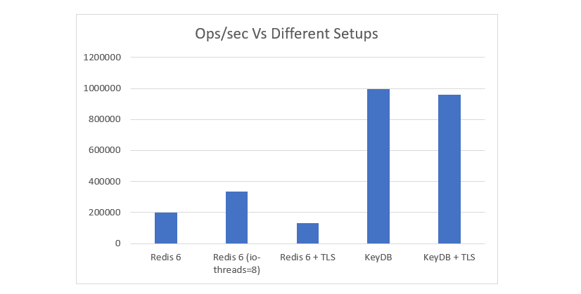

<div align="center">
  <div>&nbsp;</div>
    
  <div>&nbsp;</div>
</div>

<div style="display: flex; justify-content: center;" >
<div style="max-width: 700px;" >

# [Day2Day Group Technologies](https://day2dayja.com)

Created by: [**MrDay2Day**](https://github.com/MrDay2Day)  
Node Version: [**v22.6**](https://nodejs.org/en/download/package-manager)

## What is **Repo** this?

**Short answer:** A Boilerplate NodeJS Express Server Template written in Typescript built for scale!

**The not so short answer:** This is a _work-in-progress_ **boilerplate** `Typescript` written `Express` `REST` Server with integrated `WebSocket` & ~~`Redis`~~ **->** `KeyDB/ValKey`. This _template_ is design to operate at scale using ~~`Redis`~~ **->** `KeyDB/ValKey` and can easily be deployed as a node cluster or/and on separate machines locally or/and globally.

This template has built-in file management using `S3` _(Simple Storage Service)_ protocol and an emailing engine that can send raw `html` emails with **attachments** through `AWS SES` _(Simple Emailing Service)_.

**NB:**_There is also a unique authorization method which I personally use which tags all machines with a unique id stored in a cookie that make a request to server so you are able to have some sense of the devices used by your users and is also very helpful when it comes to security and usage patterns for users._

### **These are all custom solutions and are at no point in time a RULE that must be followed, you are welcome to make changes as you see fit.**

## Why did I build **Repo**?

Simple I am a **developer** who creates a lot of _servers_ and I often find myself _copying_ and _pasting_ from previous projects the same code. So I said to myself why not just create a _general template_ that has all the things I use most in my favorite worse language `Javascript` with a bit of seasoning being `Typescript`.

So I've integrated a lot of 3rd party packages and services which I know a lot of people will love and also so honorary mentions from my favorites' list.

### Services

- Backblaze
- AWS SES
- ClickSend

### Databases

- MongoDB
- MySQL
- PostGreSQL
- ~~Redis~~ -> KeyDB/ValKey (Pub/Sub implementation **ONLY**)

### Technologies

- ExpressJS
- Kafka
- Multer
- Socket.IO
- Cors
- Compression

## Why recommend **KeyDB/ValKey** > Redis🖕🏿

Well, that is because of the whole [license](https://redis.io/legal/licenses/) issue and performance. In multiple test KeDB out performed `Redis` by a significant amount. [**`KeyDB`**](https://docs.keydb.dev/)**`/`**[**`ValKey`**](https://valkey.io/) might not be fully up-to-date with `Redis` 7 however it still has most of the main features of `Redis` to be used as an alternative for cache store, database & Pub/Sub(amongst other key features).



You are still able to use `Redis` if it and it's license best suit your needs

# **Key Features**

1. TypeScript for faster development.
1. Self generating SQL databases and tables.
1. WebSocket Enabled via SocketIO.
1. Scalability through ~~Redis~~ **-> KeyDB/ValKey** using websocket connections.
1. Using multiple database concurrently.
1. File management.
1. Docker Enabled.

# Development Environment Setup

Copy and paste `.env.template` to `.env`

```bash
cp .env.template .env
```

Then edit the `.env` file with the necessary credentials. Input the required information for the services/features/libraries which will be used.

You are able to use multiple databases in this template whether individually or all at once `PostGres`, `MySQL` and `MongoDB`.

You are able to auto create Database and Tables/Collections on the fly when server starts up.
_NB: Database can be activated of deactivated based on the `*_ACTIVE` (\* = MONGO | PG | MYSQL) variable `y` is for active, leave blank if not active eg: `MYSQL_ACTUVE=y`._

After Environment variables are setup in the .env file you need to do a `ci`_(Continuous Integration)_ installation of the `node_modules`:

```bash
npm ci
```

### Local Development

To start **server** in development mode and compile to vanilla Javascript then run with nodemon use:

```bash
npm run dev
```

To run **Typescript** using `ts-node`:

```bash
npm run ts-dev
```

### Using Docker for development.

This template allows you to use Docker for both **development** and **production**. As a developer you are free to make any changes you see fit to customize the development environment. **If you do not know what you are doing do not edit any changes**.

To start development in Docker you can use the shell script, this starts the development server in docker using user `Node v22.6` with `ts-node` executing **Typescript**.

```bash
./app.sh docker-dev
```

To user `nodemon` while compiling **Typescript** to **Javascript**

```bash
./app.sh docker-dev-node
```

## Production Setup

### Local Production Deployment

Deploying on server the simple way.

```bash
npm run start
```

This does a `Typescript` compilation then executes the `Javascript` code via `'code/server.js'`

If you have any issues as it relates to type errors can also do a manual compilation by using:

```bash
npm run tsc
```

then:

```bash
npm run start-server
```

The `npm run start-server` command runs the `'code/server.js'` directly

### Docker Production Deployment

To do a production deployment using Docker, use the `app.sh` script.
A simple deployment is as follows:

```bash
./app.sh docker-prod
```

This will deploy a single container of the server.

You are able to deploy as a cluster for availability and load balance using `nginx`. The environment variable `CLUSTER_SIZE` is use to determine the cluster's size.
To Deploy use the following script:

```bash
./app.sh docker-cluster
```

### PM2 Production Deployment

To deploy using PM2 is simple just use the following script:

```bash
./app.sh pm2-deploy
```

This will deploy a PM2 cluster of the server.
To restart the cluster simple use:

```bash
./app.sh pm2-restart
```

To stop the cluster you just need to run

```bash
./app.sh pm2-stop
```

## Changing Node Version

To change Node version ensure your change the version in `package.json`:

```json
{
  "engines": {
    "node": "22.6" << Change here
  },
  ...
}
```

..and also the `Node` version in the `docker-compose-*.yml` files are controller by the `.env` file:

```.env
PORT=3330
```

## Adjusting Cluster Size

To adjust cluster size for deployment using Docker or PM2 edit `.env` file

```env
CLUSTER_SIZE=5
```

This will deploy a cluster with 5 nodes.

# **Utility Helper Codes**

| Title                      | Code Example                             | Description                                                                                   |
| -------------------------- | ---------------------------------------- | --------------------------------------------------------------------------------------------- |
| Random Number Generator    | `getRandomNumber(number, number)`        | Takes in a high and low number and returns a random number in-between both.                   |
| Random String Generator    | `generateString(length)`                 | Great for creating temporary passwords with uppercase, lowercase, number & special character. |
| JSON Data Checker          | `checkJSONToData<DataType>(JSON)`        | Check if a string is JSON and if it is the expected type structure.                           |
| Random select from Array   | `getRandomElement<ArrayDataType>(array)` | Randomly select an element from an array.                                                     |
| String to Number Converter | `isStringNumber(string)`                 | Converts a string to a number if possible.                                                    |

# **Feature & Technologies**

These are features & technologies that may or may not be integrated in the future.

### **Stages 👇🏿**

| Icon | Status      |
| ---- | ----------- |
| ✅   | Completed   |
| ➡️   | In Progress |
| ✏️   | Planning    |
| 💭   | Considering |
| ⚠️   | Issue       |
| ❌   | Cancelled   |

### **Implementation Style 👇🏿**

| Icon | Implementation                                                        |
| ---- | --------------------------------------------------------------------- |
| 💡   | Custom Implementation _(Custom implementations with docs & examples)_ |
| 🕯️   | Standard/Traditional Implementation                                   |
| ❓   | Not Sure                                                              |

### **Current List**

| Status | Feature                   | Implementation | Notes                                                                                                            |
| ------ | ------------------------- | -------------- | ---------------------------------------------------------------------------------------------------------------- |
| ✅     | MySQL                     | 💡             | Industry "go to" for database.                                                                                   |
| ✅     | PostGrSQL                 | 💡             | _[Large community of extension](https://gist.github.com/joelonsql/e5aa27f8cc9bd22b8999b7de8aee9d47)_.            |
| ✅     | MongoDB                   | 💡             | Recommended DB for Scale.                                                                                        |
| ✅     | Socket.IO                 | 💡             | Realtime Communication between client and server.                                                                |
| ✅     | ~~Redis~~ -> KeyDB/ValKey | 💡             | Pub/Sub implementation **ONLY** used for cluster communication, can be used as DB cache                          |
| ✅     | Multer                    | 💡             | File Management for `form-data` uploads.                                                                         |
| ✅     | Backblaze                 | 💡             | S3 Storage - Private & Public.                                                                                   |
| ✅     | Dockerize                 | 🕯️             | For Development and Production Deployment.                                                                       |
| ✅     | Custom Task Queue / CRON  | 🕯️             |
| ✏️     | SMS                       | 🕯️             |
| ✅     | AWS-SES                   | 💡             | Emailing Service, send emails directly from server or integrate AWS-SES templates easily.                        |
| ⚠️     | tRCP                      |                |
| ❌     | GraphQL                   |                |
| ✅     | TS-NODE                   | 💡             | Run TypeScript code directly without needing to compile it into JavaScript first for development and deployment. |
| ➡️     | ServerSide Events Example | 💡             |
| ❌     | HandlebarsJS Examples     |                |                                                                                                                  |
| ✏️     | Kayka                     | 💡             |                                                                                                                  |

### **Payments**

| Status | Feature | Implementation | Notes |
| ------ | ------- | -------------- | ----- |
| ✏️     | Paddle  | ❓             | -     |
| ✏️     | Stripe  | ❓             | -     |
| ✏️     | Paypal  | ❓             | -     |

### **Authentication**

| Status | Feature        | Implementation | Notes                                 |
| ------ | -------------- | -------------- | ------------------------------------- |
| ✏️     | Google Auth    | ❓             | _With Recommendations and Procedures_ |
| ✏️     | Microsoft Auth | ❓             | _With Recommendations and Procedures_ |
| ✏️     | Twitter Auth   | ❓             | _With Recommendations and Procedures_ |
| ✏️     | LinkedIn Auth  | ❓             | _With Recommendations and Procedures_ |
| ✏️     | Facebook Auth  | ❓             | _With Recommendations and Procedures_ |
